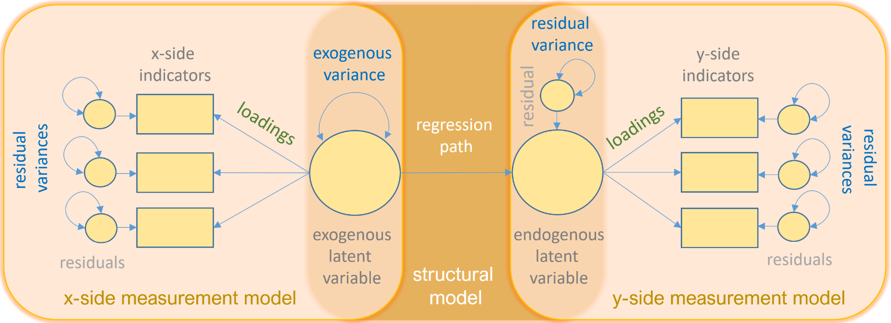

# About this course

## Course objectives

 - understand the foundations of SEM
 - build up a comprehensive understanding of related techniques (e.g., linear regression, factor analysis)
 - practical applications in R

## Logistics & materials

::: {.fragment}
**Moodle course page**

 - exercises
 - announcements
 - private documents (e.g., solutions)
:::

::: {.fragment}
**Course website**

 - slides
:::

::: {.fragment}
**Labs**

 - exercises/labs
:::

::: footer
Content will be updated during the course.
:::

## Grading

- Participation & Exercises 25%
- Final Exam: 75%

# Why SEM?

##

::: {.fragment}
In psychology we often want to understand the human mind in terms of causal relationships between latent variables. 
:::

 

::: {.fragment}
For example:

 - childhood trauma and sleep quality affect anxiety
 - higher intelligence and education cause higher SES
:::

## Structural Equation Modeling

:::footer
image taken from [https://stats.oarc.ucla.edu/r/seminars/rsem/](https://stats.oarc.ucla.edu/r/seminars/rsem/)

:::

## Structural Equation Modeling

::: {.incremental}
- **Multivariate** statistical technique
- Combines **factor analysis** and **regression/path analysis**
- Can model complex relationships
  - Multiple predictors
  - Multiple outcomes
  - Latent variables
  - Measurement error
- Can test and compare theoretical models
:::

# Examples

## Examples

 - [Zhou Q, Liu S, Chen J, Tuersun Y, Liang Z, Wang C, Sun J, Yuan L, Qian Y. The role of sleep quality and anxiety symptoms in the association between childhood trauma and self-harm attempt: A chain-mediated analysis in the UK Biobank. J Affect Disord. 2024 Oct 1;362:569-577. doi: 10.1016/j.jad.2024.07.041. Epub 2024 Jul 15. PMID: 39019228.](https://www.sciencedirect.com/science/article/pii/S0165032724011121?via%3Dihub)

 - [Sun, M., Piao, M. & Jia, Z. The impact of alexithymia, anxiety, social pressure, and academic burnout on depression in Chinese university students: an analysis based on SEM. BMC Psychol 12, 757 (2024). https://doi.org/10.1186/s40359-024-02262-y](https://link.springer.com/article/10.1186/s40359-024-02262-y#citeas)

# Exercise

## Exercise {.smaller}

::: {.fragment}
1. Find a paper presenting 1 SEM model on a topic that interests you.
:::

:::: {.fragment}
2. Create a 1 page PDF document with the following information:
    - reference of the paper
    - SEM diagram
    - a sentence or short paragraph describing what you take out of that diagram

::::

:::: {.fragment}

3. Save the PDF file using the following naming convention:
    - \<last_name>_sem-example.pdf

::::

:::: {.fragment}

4. Post the PDF on Moodle

::::

::: footer
Tip: search for images.
:::

