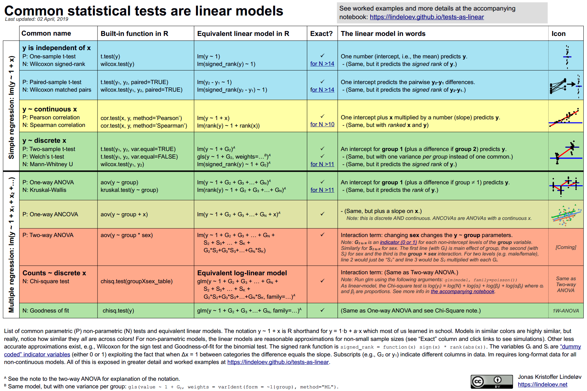
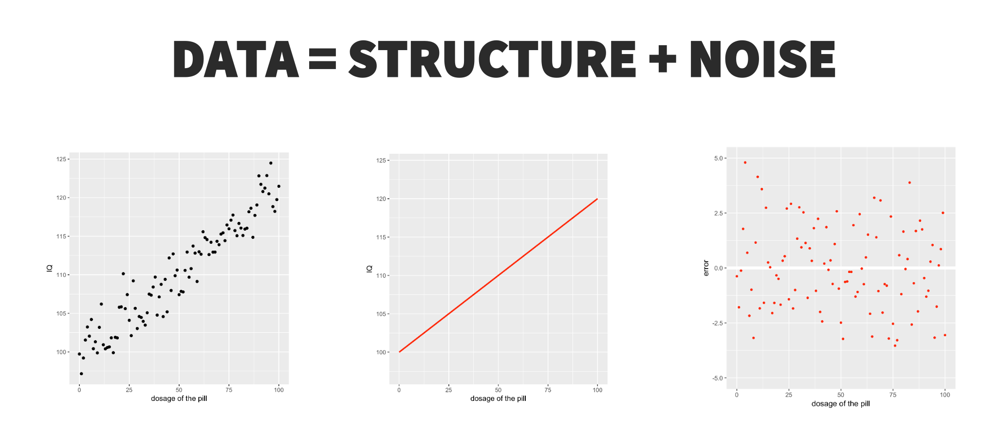
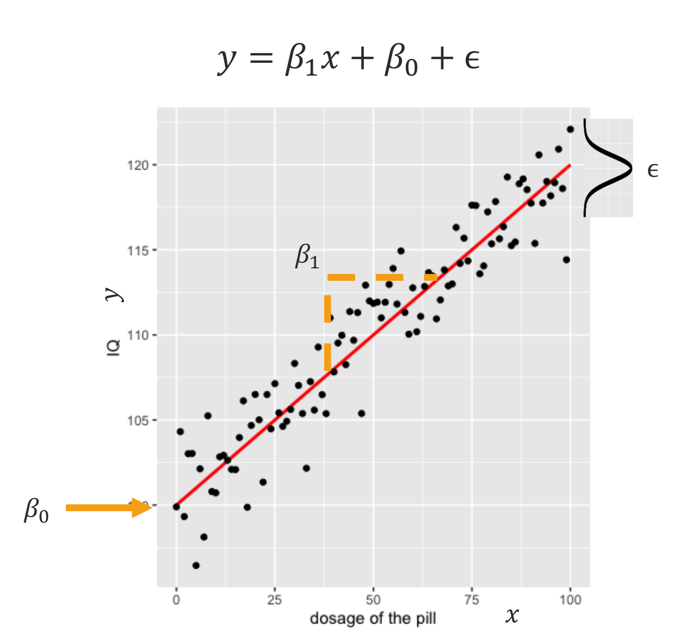
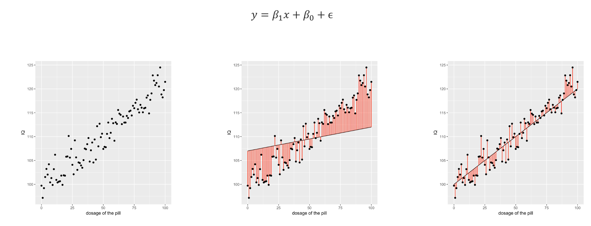
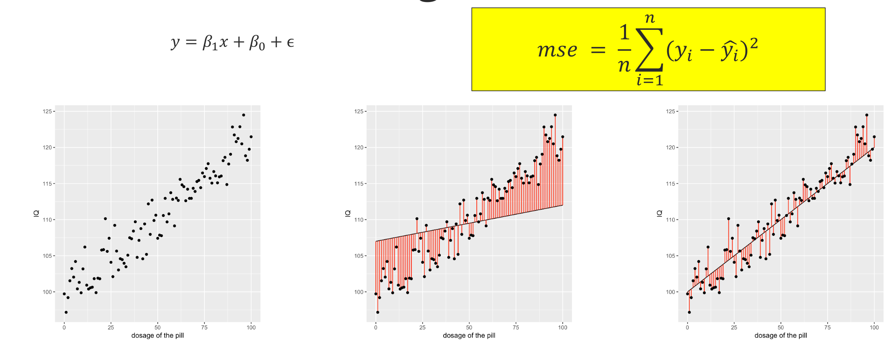
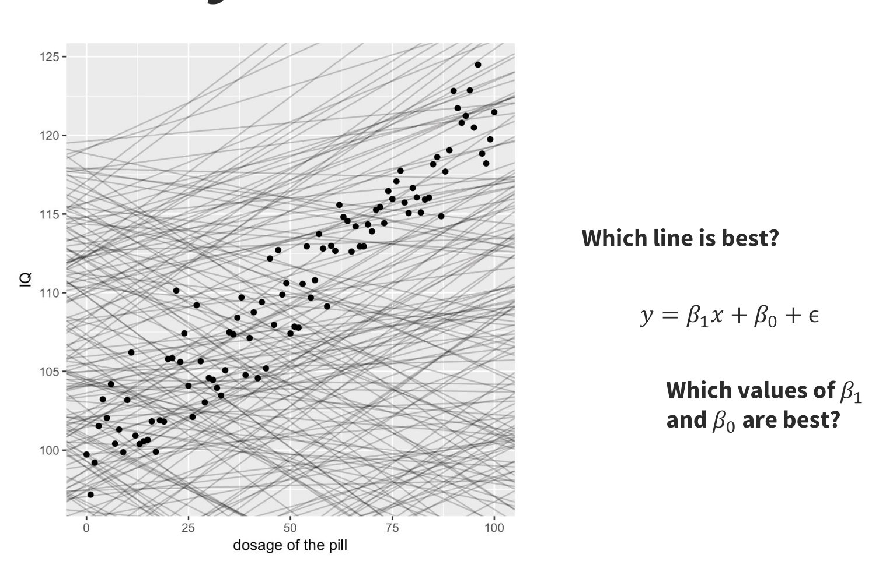
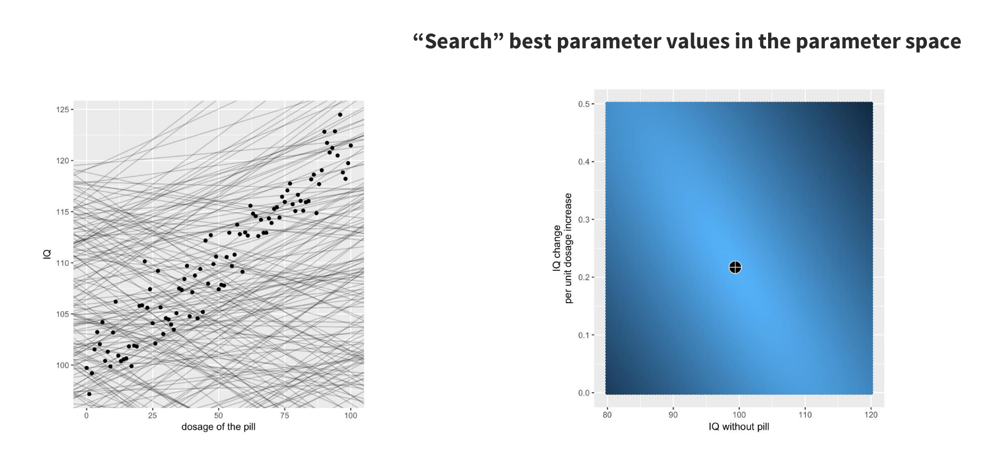
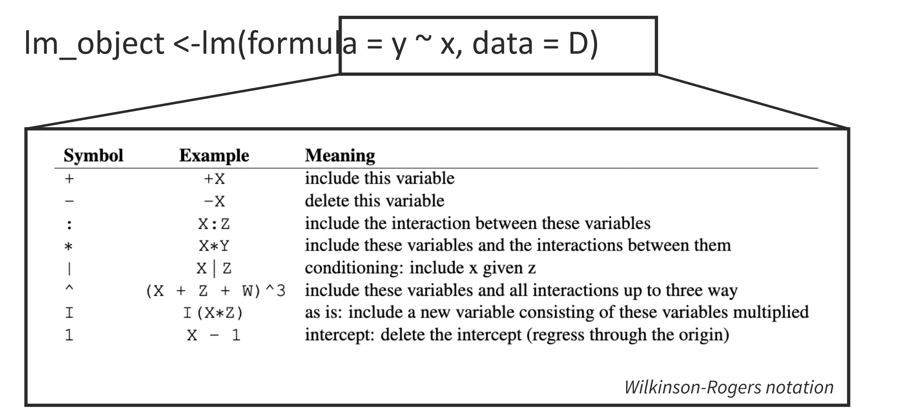

## Linear Regression 

[Common statistical tests are linear models](https://lindeloev.github.io/tests-as-linear/)





##

Many resources:

- [statsandr](https://statsandr.com/blog/multiple-linear-regression-made-simple/)

- [Data Analysis: A Model Comparison Approach](https://www.taylorfrancis.com/books/mono/10.4324/9781003438335/data-analysis-charles-judd-gary-mcclelland-carey-ryan-josh-correll-abigail-folberg)


## Key concepts {.smaller}

::: {.columns}

:::: {.column}
::: {.incremental}
1. linear model
1. interpreting coefficients
1. assumptions
1. diagnostics 
1. goodness of fit
1. fitting a model
1. overfitting
:::
::::

:::: {.column}
<ol start="8">
<li class="fragment">mean squared error</li>
<li class="fragment">R², R² adjusted</li>
<li class="fragment">hypothesis testing (p value)</li>
<li class="fragment">degrees of freedom</li>
<li class="fragment">standardized coefficients</li>
<li class="fragment">linear regression and correlation</li>
<li class="fragment">inference vs prediction</li>
</ol>
::::

:::


##




##  {.center}
Error distribution

::: {.columns}

:::: {.column}
```{r}
#| echo: false
#| fig-width: 7
#| fig-height: 4
library(ggplot2)

x <- seq(-4, 4, length.out = 500)
y <- dnorm(x, mean = 0, sd = 1)

ggplot(data.frame(x = x, y = y), aes(x, y)) +
  geom_line(linewidth = 1.2, colour = "#2c7bb6") +
  geom_area(alpha = 0.15, fill = "#2c7bb6") +
  scale_x_continuous(
    breaks = -3:3,
    labels = c("-3σ", "-2σ", "-1σ", "0", "1σ", "2σ", "3σ")
  ) +
  labs(x = NULL, y = "Density") +
  theme_minimal(base_size = 16)
```
:::: 


:::: {.column}
$$f(x) = \frac{1}{\sigma\sqrt{2\pi}}\, e^{-\frac{(x-\mu)^2}{2\sigma^2}}$$

::::

:::


## {.center}
Interpretation of the parameter values and their meaning is fundamental!




## The Linear Model

$$Y = \beta_0 + \beta_1 X + \varepsilon$$

::: {.columns}
::: {.column width="50%"}
**Parameters**

- $\beta_0$: intercept
- $\beta_1$: slope
- $\varepsilon$: error (residual)
:::
::: {.column width="50%"}
**Interpretation**

- $\beta_0$: Y when X = 0
- $\beta_1$: change in Y per unit of X
- $\varepsilon$: unexplained variation
:::
:::


## {.center}
Interpretation of the parameter values and their meaning is fundamental!


What is the value of $\beta_0$ and $\beta_1$? 


## {.center}
Goodness of Fit (gof) 



- Which fit is better?
- How can you quantify this?


## {.center}




## {.center}




## Ordinary Least Squares (OLS)

::: {.incremental}
- OLS finds the line that **minimises the sum of squared residuals**
$$\min \sum_{i=1}^n (Y_i - \hat{Y}_i)^2$$
- **Residual**: $e_i = Y_i - \hat{Y}_i$
- Closed-form solution exists
- Best linear unbiased estimator (BLUE) under assumptions
:::

## Evaluating Fit: R²

$$R^2 = 1 - \frac{SS_{residual}}{SS_{total}} = \frac{SS_{model}}{SS_{total}}$$

::: {.incremental}
- Proportion of variance in Y explained by X
- Range: 0 (no fit) to 1 (perfect fit)
- R² = .25 → X explains 25% of variance in Y
- Is R² "large"? **Depends on the field and question**
:::


## Understanding R² {.smaller}

$$R^2 = 1 - \frac{SS_{residual}}{SS_{total}} = \frac{SS_{model}}{SS_{total}}$$


- compute the variance of Y: this is the total variance
- compute the variance of the residuals: by definition, this is what your model cannot explain
- express the variance of the residuals as a *proportion* of the total variance: this is the proportion of the variance of Y that your model **cannot** explain
- the proportion of the total variance that your model **can** explain is the remaining percentage of the total variance. 
- Note: $SS_{total}$ is the sum of squared errors relative to the mean; the variance is this $SS_{total}/(n-1)$; $SS_{residuals}$ is the same as $SS_{total}-SS_{model}$.


## {.center}




# linear regression in R


## {.center}




## Regression in R

```{r}
#| echo: true
#| eval: true
set.seed(42)
dat <- data.frame(
  alexithymia = rnorm(100, 50, 10),
  distress    = rnorm(100, 40, 9)
)
fit <- lm(distress ~ alexithymia, data = dat)
summary(fit)
```

## Reading the Output

::: {.incremental}
- **Estimate**: $\hat\beta$ values (intercept and slope)
- **Std. Error**: precision of the estimate
- **t value**: $\hat\beta / SE$
- **Pr(>|t|)**: p-value (is the coefficient ≠ 0?)
- **Multiple R-squared**: proportion of variance explained
- **F-statistic**: overall model significance
:::

## Statistical Inference

::: {.incremental}
**Hypothesis test for slope:**

$H_0: \beta_1 = 0$ (X has no linear relationship with Y)

$t = \dfrac{\hat\beta_1}{SE(\hat\beta_1)}$

**95% Confidence Interval:**

$\hat\beta_1 \pm t_{critical} \times SE(\hat\beta_1)$
:::


## Assumptions of Linear Regression

::: {.incremental}
1. **Linearity** — relationship between X and Y is linear
2. **Independence** — observations are independent
3. **Homoscedasticity** — constant variance of errors
4. **Normality of residuals** — errors ≈ normal
5. *(No measurement error in X — relaxed in SEM!)*
:::

## Diagnostic Plots

```{r}
#| echo: false
#| dev: png
#| fig-height: 4.5
#| fig-width: 9
#| fig-align: center
par(mfrow = c(1, 3))
# Residuals vs fitted
plot(fitted(fit), residuals(fit),
     xlab = "Fitted values", ylab = "Residuals",
     main = "Residuals vs Fitted", pch = 19, col = "steelblue")
abline(h = 0, col = "red", lty = 2)

# Q-Q plot
qqnorm(residuals(fit), main = "Normal Q-Q", pch = 19, col = "steelblue")
qqline(residuals(fit), col = "red")

# Scale-location
plot(fitted(fit), sqrt(abs(residuals(fit))),
     xlab = "Fitted values", ylab = "√|Residuals|",
     main = "Scale-Location", pch = 19, col = "steelblue")
```


# Exercise

## the `attitude` datasets {.smaller}


The attitude dataset is a built-in dataset in R that's great for learning and practicing basic data manipulation and statistical analysis. It contains the results of a survey of 30 employees, measuring their attitude towards their work. The dataset has seven columns

**rating**: Overall rating of the company's work climate

**complaints**: Handling of employee complaints

**privileges**: Employee privileges

**learning**: Opportunity for learning

**raises**:  Opportunity for raises

**advance**: Opportunity for advancement

**pleasantness**: Pleasantness of the work environment


##

```{r}
#| echo: true

data(attitude)
help(attitude)

```


##
**Exercise**


Using the `attitude` dataset, 

- run a simple linear regression to explain the variable `rating` as a function of **one** of the other variables. 
- does the model fit the data well?
- what can you say about the model? 


